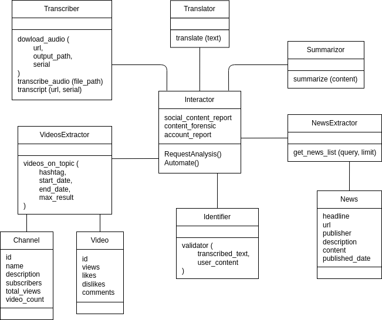

## Social Guard System
The Social Guard system is a cutting-edge solution designed to combat misinformation, cyberbullying, and harmful online content by combining AI, real-time data, and a robust verification mechanism. This system leverages state-of-the-art models and technologies to monitor and protect users across various online platforms, ensuring a safer and more secure digital space.

## Key Features
1. AI-Powered Content Detection
Social Guard utilizes advanced Natural Language Processing (NLP) and machine learning models to detect harmful content, such as offensive language, fake news, and instances of cyberbullying across multiple online platforms. This enables quick moderation and intervention, keeping online environments safe for users.

2. Video Content Verification Using YouTube API
The system integrates the YouTube API to fetch videos related to trending topics in the user's location. These videos are then cross-checked with trusted news sources, blogs, and articles (e.g., from Google News), helping to identify and address misleading or fake information in real-time.

3. Multi-Language Support with Large Language Models (LLM)
Social Guard processes videos in multiple languages, leveraging LLM models like LLaMA 38B to transcribe video content and summarize it in various languages. This ensures accurate, concise content summaries that can be easily understood by users, regardless of their language preference.

4. Cross-Platform Monitoring
The system offers continuous monitoring of content across various social media platforms, including Facebook, Instagram, and Twitter, by integrating APIs and web scraping technologies. This broad coverage ensures that users are protected no matter where they engage online.

5. Real-Time Analytics and Alerts
Social Guard features a powerful analytics dashboard, providing real-time insights into harmful content trends. Users and administrators can receive timely alerts and detailed reports about detected issues, enabling swift intervention and a proactive approach to online safety.

6. Ethical AI and Data Privacy
The system prioritizes user privacy by anonymizing and securely encrypting all personal data. Adhering to ethical AI practices, Social Guard ensures that privacy and security are maintained while monitoring harmful content.

7. Scalability and Flexibility
Social Guard is designed with scalability in mind, allowing the system to easily accommodate new platforms, languages, and evolving content detection models. Its modular architecture ensures long-term adaptability in the face of emerging online threats.

Unique Features
Cross-Platform Integration: Real-time monitoring across multiple social media platforms like Facebook, Instagram, and Twitter, providing broader protection compared to single-platform solutions.

Advanced Video Verification: By utilizing the YouTube API and verifying video content against trusted sources such as Google News, Social Guard ensures the authenticity of online videos, effectively combating misinformation.

Multi-Language AI Support: The system uses advanced LLMs like LLaMA 38B to summarize and translate content in various languages, making it adaptable for global use.

Real-Time Analytics: With its analytics dashboard, Social Guard offers instant insights into harmful content trends, enabling fast intervention and informed decision-making.

Comprehensive Content Detection: The system integrates multiple monitoring layers, including sentiment analysis and misinformation detection, unlike traditional tools that focus on just one aspect.

Ethical AI and Data Privacy: The system places a strong emphasis on user privacy, utilizing encryption and anonymization techniques, and adhering to ethical AI standards.

Scalability: Social Guard’s modular architecture allows it to easily scale to new platforms and stay effective against evolving online threats.

## Low Level Design

